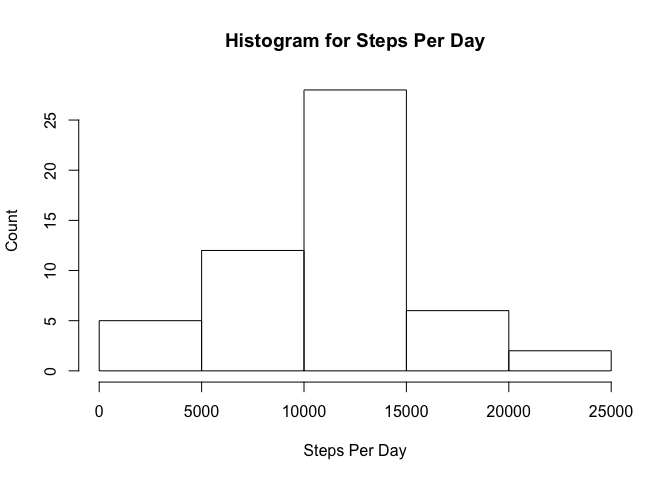
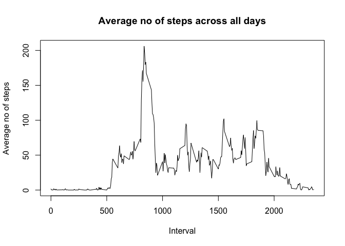
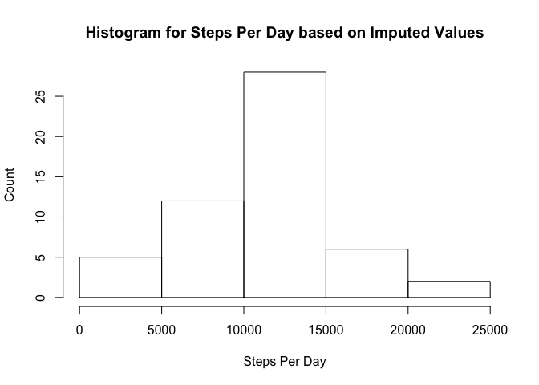
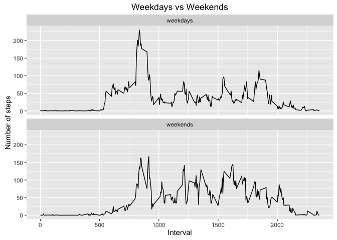

# Reproducible Research: Peer Assessment 1


## Loading and preprocessing the data

```r
# load CSV
activity <- read.csv("./activity.csv", stringsAsFactors = F)
# strip off all NA values
activity <- na.omit(activity)
require(ggplot2)
```

```
## Loading required package: ggplot2
```

```
## Warning: package 'ggplot2' was built under R version 3.2.4
```


## What is mean total number of steps taken per day?
1. Make a histogram of the total number of steps taken each day

```r
# aggregate total steps per day
total_steps_per_day <- aggregate(steps ~ date, activity, FUN = sum)
# generate histogram
hist(total_steps_per_day$steps, xlab = "Steps Per Day", ylab = "Count",
     main = "Histogram for Steps Per Day")
```

<!-- -->
2. Calculate and report the mean and median of the total number of steps taken per dayHistogram of the total number of steps taken each day

```r
# format to force integer display
mean_tspd <- formatC(mean(total_steps_per_day$steps), format = 'd')
# format to force integer display
median_tspd <- formatC(median(total_steps_per_day$steps), format = 'd')
```
The mean = 10766 and the median = 10765

## What is the average daily activity pattern?

1. Make a time series plot (i.e. ???????????????? = "????") of the 5-minute interval (x-axis) and the average number of steps taken, averaged across all days (y-axis)

```r
# aggregate average steps for each interval
avg_steps_taken <- aggregate(steps ~ interval, activity, FUN = mean)
# plot average no of steps per interval
with(avg_steps_taken, plot(interval, steps, type = 'l', xlab = "Interval", ylab = "Average no of steps", main = "Average no of steps across all days"))
```

<!-- -->

2. Which 5-minute interval, on average across all the days in the dataset, contains the maximum number of steps?

```r
# determine which row contains the max average steps taken
max_avg_steps_row_no <- which.max(avg_steps_taken$steps)
# get the max average steps taken
avg_steps_taken[max_avg_steps_row_no, ]
```

```
##     interval    steps
## 104      835 206.1698
```
## Imputing missing values
1. Calculate and report the total number of missing values in the dataset (i.e. the total number of rows with ????????s)

```r
# re-read activity data
activity <- read.csv("./activity.csv", stringsAsFactors = F)
# incomplete case will be set as TRUE, adding all TRUE will give the number of rows with NA values
sum(!complete.cases(activity))
```

```
## [1] 2304
```
2. Devise a strategy for filling in all of the missing values in the dataset. The strategy does not need to be sophisticated. For example, you could use the mean/median for that day, or the mean for that 5-minute interval, etc.
3. Create a new dataset that is equal to the original dataset but with the missing data filled in.

```r
# go thru all rows
for (i in 1:nrow(activity)) {
        # if the row contains NA value
        if (!complete.cases(activity$steps[i])) {
                # get the average steps taken from the avg_steps_taken data frame and replace the NA with the average steps taken at the same interval
                missing_int <- activity$interval[i]
                mean_steps_row <- which(avg_steps_taken$interval == missing_int)
                activity$steps[i] <- avg_steps_taken$steps[mean_steps_row]
        }
}
```
4. Make a histogram of the total number of steps taken each day and Calculate and report the mean and median total number of steps taken per day. Do these values differ from the estimates from the first part of the assignment? What is the impact of imputing missing data on the estimates of the total daily number of steps?
<!-- -->

The difference between NA-removed and Imputed for mean is 0 and for median is -1. From the difference, NA-removed and Imputed values are very similar.

## Are there differences in activity patterns between weekdays and weekends?
1. Create a new factor variable in the dataset with two levels - "weekday" and "weekend" indicating whether a given date is a weekday or weekend day

```r
# convert the date string to date field
activity$date <- as.Date(activity$date, "%Y-%m-%d")
# by default fill with weekdays
activity$daytype <- "weekdays"
# if detected Sat or Sun, replace with "weekends"
activity$daytype[which(weekdays(activity$date) == "Saturday")] <- "weekends"
activity$daytype[which(weekdays(activity$date) == "Sunday")] <- "weekends"
# convert daytype to factor
activity$daytype <- as.factor(activity$daytype)
```
2. Make a panel plot containing  time series plot (i.e. type = 'l') of the 5-minutes interval (x-axis) and the average number of steps taken, averaged across all weekday days or weekend days (y-axis).

```r
# aggregate the imputed values group by weekends and weekdays
imputed_avg_steps_by_int_daytype <- aggregate(steps ~ interval + daytype, activity, FUN = mean)
# plot the graph
qplot(interval, steps, data = imputed_avg_steps_by_int_daytype, geom = c("line"), xlab = "Interval", ylab = "Number of steps", main = "Weekdays vs Weekends") + facet_wrap(~ daytype, ncol = 1)
```

<!-- -->
        
